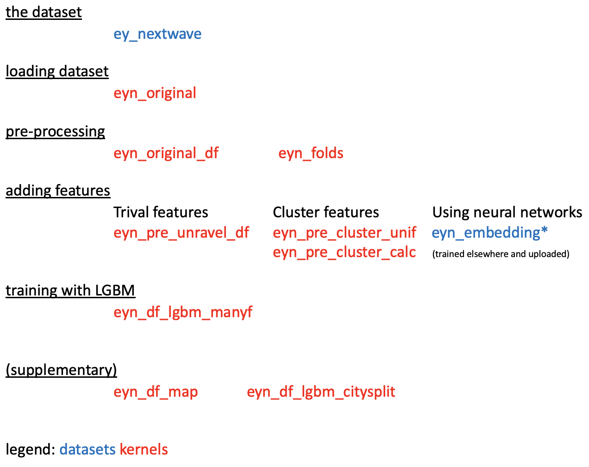
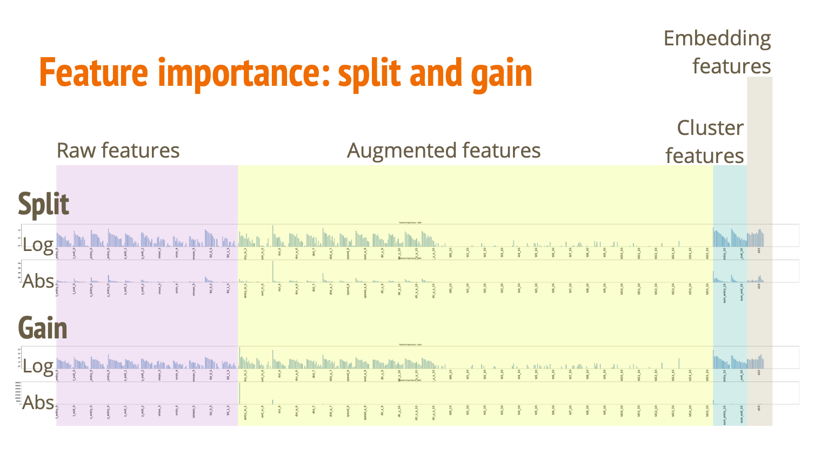
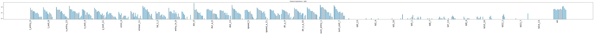
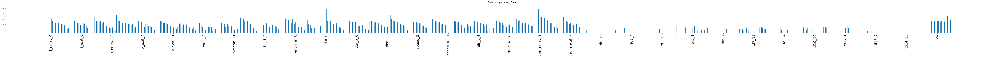
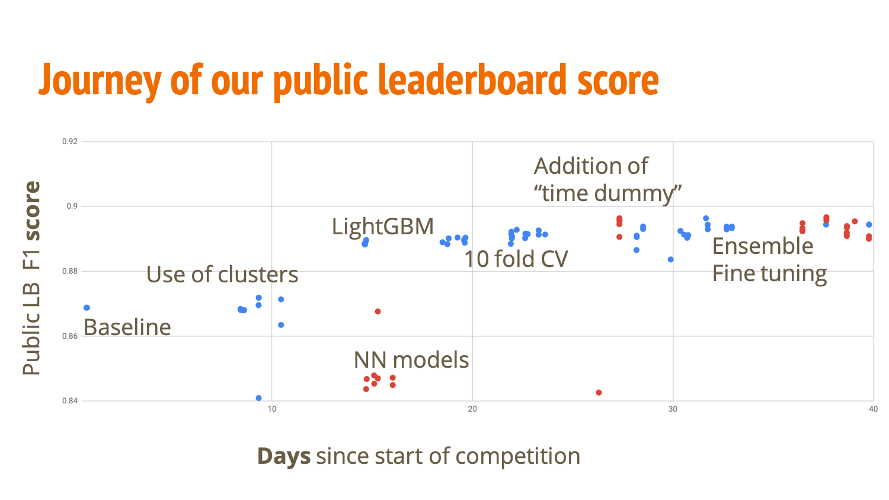

# Ernst & Young NextWave Data Science Competition
Collaborated with [Zheng Xingjian](https://github.com/mrrollingjerry)  
Competition link: https://datascience.ey.com/challenge/1

## Results
With a public F1 score of 0.89441 and private F1 score of 0.88923, we are 6th globally and 3rd in Singapore. 
We also presented in Singapore finals, and we were third.
- The kernel that produced the final submission: https://www.kaggle.com/huikang/eyn-df-lgbm-manyf?scriptVersionId=13913268

## Challenge
The dataset is a set of anonymized geolocation data of multiple mobile devices in the City of Atlanta (US) for 11 working days in October 2018. In each "device", there may be up to 20 "trajectories". Each trajectory has the following information.

| Variable name | Type    | Description 
| --------------|---------|-------------
| hash          | String  | Represents the unique identifier of a device
| trajectory_id | String  | Represents the unique identifier of a trajectory associated to a device
| time_entry    | Date    | Indicates the local time for the starting point of the trajectory (HH:mm:ss)
| time_exit     | Date    | Indicates the local time for the ending point of the trajectory (HH:mm:ss)
| Vmax          | Integer | Represents the maximum velocity registered in the course of a trajectory.
| Vmin          | Integer | Represents the minimum velocity registered in the course of a trajectory.
| Vmean         | Integer | Represents the average velocity registered in the course of a trajectory.
| x_entry       | Double  | Entry x coordinate (cartesian projected position)
| y_entry       | Double  | Entry y coordinate (cartesian projected position)
| x_exit        | Double  | Exit x coordinate (cartesian projected position)
| y_exit        | Double  | Exit y coordinate (cartesian projected position)

Vmax Vmin and Vmean may not be recorded.

The task is to predict the location of this last exit point and whether this device is within the city center or not. The target variable is the latter. 

## Some terminologies 
We use the following terms in bold to make our explanation more intuitive
- The **last seen location** are is the coordinates of x_entry and y_entry of the final trajectory. While different devices have a different number of trajectory, all devices have a final trajectory and hence a last seen location. 
- If the "last seen location" of the device is outside the boundary, we say that the device is **last seen inside**. Otherwise, the device is **last seen outside**. 
- If the **final duration** (time_exit - time_entry) is zero, we say the device is **stationary**. Otherwise, the device is **not stationary**. Note that in the use of this term we are concerned with the last trajectory.
- The **final location** is the coordinates of the last exit point. Note that this is not given in the test set.
- If the final location is inside the boundary, we say that the device **ends up inside**. Otherwise, the device **ends up outside**. We should return a target of 1.0 in our submission if we predict the device to end up inside; otherwise, we should return a value of 0.0.

## Basic analysis
- If we predict all the points to end up inside, you will get a public F1 score of 0.43379. This is indicative of the proportion of points that end up inside in the test set.

The following shows the distributions on whether the points are last seen inside or outside, stationary or not stationary.

##### Training set

| Quantity       | Last seen inside | Last seen outside | Total
| ---------------|------------------|-------------------|------
| Stationary     | 19512            | 47486             | 66998  
| Not stationary | 18937            | 48128             | 67065  
| Total          | 38449            | 95614             | 134063

##### Testing set

| Quantity       | Last seen inside | Last seen outside | Total
| ---------------|------------------|-------------------|------
| Stationary     | 4861             | 11980             | 16841
| Not stationary | 4683             | 11991             | 16674
| Total          | 9544             | 23971             | 35515

#### Naive predictions
If the point is stationary, the last seen location is the final location. 
If we predict the final location to be the last seen location, we get an F1 score of **0.86881**. 
Surprisingly, at the end, many participants did not achieve such a score.

## Visualisations
The points plotted are the last seen location. Points that end up inside are in blue, and points at end up outside are in red.

The stationary points have its last seen location equal to its final location.

The challenge is to predict the nonstationary points.

We can see that the roads resembling veins are more visible in the scatter plot of non-stationary points. 
The above visualisations in produced in https://www.kaggle.com/huikang/eyn-df-map

## Kernels
Preprocessing and training is done on Kaggle, which provides free storage and computing services. 
The python code is run on Jupyter notebooks, which are called "kernels" on Kaggle. 
Kaggle kernels also have a version control system that allows different versions of the notebook and results to be saved.
For documentation, we log the public leaderboard results in the comment section.

### Overview of kernels
We have separate kernels for separate functions so that preprocessing need not be repeated. 
It also makes the pipeline more stable upstream data are frozen with version control.

The following chart shows the order of how the kernels are run. 
Each kernel depends on one or more kernels from the above.

### List of kernels
Source dataset  
https://www.kaggle.com/huikang/ey-nextwave

Given dataset, pivot and produce numpy arrays representing the data  
https://www.kaggle.com/huikang/eyn-original 

Transforming numpy arrays into pandas dataframe pickle  
https://www.kaggle.com/huikang/eyn-original-df

Adding trivial features on top of the dataframe  
https://www.kaggle.com/huikang/eyn-pre-unravel-df

Definition of fold for standardisation across experiments  
https://www.kaggle.com/huikang/eyn-folds

Obtaining the full set of features for training embeddings  
https://www.kaggle.com/huikang/eyn-pre-unravel-full-targets-df

Dataset containing the embeddings generated  
https://www.kaggle.com/mrjerry/eynembedding

Finding the nearest last-seen-points and its target value  
https://www.kaggle.com/huikang/eyn-pre-cluster-unif

Taking the weight average of nearest last-seen-points  
https://www.kaggle.com/huikang/eyn-pre-cluster-calc

The actual model  
https://www.kaggle.com/huikang/eyn-df-lgbm-manyf

#### Supplementary kernels for visualisation
Separate models for stationary points that are last seen inside and last seen outside
https://www.kaggle.com/huikang/eyn-df-lgbm-citysplit

To visualise the distribution of the last seen location and whether it ends up inside
https://www.kaggle.com/huikang/eyn-df-map

## Solution and Discussion
We discuss our approach and reflections.

### Features of our solution
- **Transformation into an array of 21\*13 elements** for each "device" from the source dataset. The standardisation allows for easier data processing downstream.
- **Reversed order of trajectory** in the array. With the last trajectory is always at position zero, the last seen location, final duration and always at the same location. 
- **10-fold cross validation**. This is a standard for datasets with this amount of data. The folds, which are stratified, are defined in `eyn_folds`.
- **Use of the best threshold from the training set**. We find the best threshold from the cross-validated training data instead of 0.5. More theory or evidence is necessary to understand the merit of this measure.
- **Retaining NaNs in dataframes.** We do not fill the NaN with numbers like zero, which has a different meaning. It helps as LGBM allows NaNs as input.
- **Training features**
  - **Trival features** We computed the duration, speed and distance for each trajectory. We also computed the duration, speed and distance between adjacent trajectory (this entry point and the previous trajectory's exit point).
  - **Cluster features** We place the last seen location of the non-stationary points on a map. (As we suspect that the projected coordinates are warped, the y-coordinates is scaled down by a factor of 10). To generate the cluster features for each device analysed, we use its last seen location to find the nearest 10 last seen locations. Naturally, the first last seen location is itself, so we remove this result. This above is done in `eyn_df_cluster_unif`. 
  Then we calculate a weighted average of the result. Points further away from the analysed last seen location have exponentially lower weights. This is done in `eyn_df_cluster_calc`.
  - **Embeddings as a feature** Neural networks could not produce results better than the baseline of predicting final location to be its initial location. However, we believe some learning can be transferred from a neural network. LGBM only allows for training to one target, but neural networks can be trained on multiple classes at once. The neural network model thus also trains on the final location as well as the augmented trivial features. The final layer of the neural network presents embeddings of size 15, and this is introduced to the LGBM model.
- **Use of LightGBM** There parameters are crudely tuned. Notably, the best `num_leaves` is under 100, and we used 63 eventually.

### Benefits of our solution
- No additional information used
- Consistent documentation throughout (with the shape of array printed)
- Fast training time and preprocessing time (except processing dataset into a numpy array and clustering the last seen locations)
- Visualisation of more important features
- Competitive public score of 0.89441

### Feature analysis
The LGBM model allows us to visualise the importance of the various features. In our understanding, `split` refers to how many times the feature is used and `gain` refers to how significant is the feature in training. Notably, `entry_in_0` - which refers to whether the device is last seen inside or outside - has a low split but a very large gain. 

Overview of features

Feature importance - Split

Feature importance - Gain

Open the picture in a new screen to look at the importance of the features in detail. Note that the y-axis is logarithmic.

Following is a table explaining the feature names. The feature name follows the dataframe header. `k` refers to the k-th last trajectory.

| Feature name   | Explaination
| ---------------| ------------
| t_entry_{k}    | time_entry scaled down with 0 representing 3pm and 0.1 representing 4pm
| t_exit_{k}     | time_exit scaled down similarly
| x_entry_{k}    | x_entry scaled down with 0 representing centre of city and city boundary spanning (-1,1)
| x_exit_{k}     | x_exit scaled down similarly
| y_entry_{k}    | y_entry scaled down with 0 representing centre of city and city boundary spanning (-0.3,0.3)
| y_exit_{k}     | y_exit scaled down similarly
| vmax_{k}       | from source dataset
| vmin_{k}       | from source dataset
| vmean_{k}      | from source dataset
| tid_0_{k}      | from trajectory_id, representing the trajectory number
| tid_1_{k}      | from trajectory_id, representing the day of the month
| entry_in_{k}   | whether the x_entry and y_entry is in the city boundary
| exit_in_{k}    | whether the x_exit and y_exit is in the city boundary
| dur_{k}        | t_exit - t_entry
| dur_a_{k}      | t_exit - t_entry (of the previous trajectory)
| dist_{k}       | Cartesian distance from the entry point to the exit point
| dist_a_{k}     | Cartesian distance from the exit point to the entry point of the previous trajectory
| speed_{k}      | Speed between the entry point and the exit point, stationary points have NaN speed.
| speed_a_{k}    | Speed between the exit point and the entry point of the previous trajectory
| dir_x_{k}      | Direction of the entry point to the exit point
| dir_y_{k}      | The angle is parameterised because as the angle is modular
| dir_x_a_{k}    | Direction of the exit point to the entry point of the previous trajectory 
| dir_y_a_{k}    | The y-component of about, similarly
| sum_entry_{k}  | Cluster feature of weighted average of the targets of the nearest last seen locations
| sum_exit_{k}   | Same, but the analysed point is still placed on the map of last seen locations 
| td{j}\_{k}     | Categorising the t_entry into bins of 1 hour - apparently it increased public score
| e_{k}          | Embeddings from the neural network
 
##### F1 score for various data categories

In [one kernel](https://www.kaggle.com/huikang/eyn-df-lgbm-citysplit) we separated the training into two groups, one for non-stationary points that are last seen inside, and non-stationary points that are last seen outside. No training is done for stationary points because we can assume that the final location is the last seen location. The F1 score presented is calculated over the validation set from each fold. There are only 4 folds as this kernel was constructed before we moved on to 10 folds. It shows the F1 score range for each of the data categories, and the observation that splitting the data categories to different training set does not increase LightGBM accuracy.

| CV F1 score    | Last seen inside | Last seen outside | Total
| ---------------|------------------|-------------------|------
| Stationary     | `all true`       | `all false`       | 1.000
| Not stationary | ~0.845           | ~0.375            | -
| Total          | -                | -                 | 0.884
 

##### Journey of public leaderboard
We started submitting the baseline solution of predicting final location as the last seen location. The sole use of cluster information improved our score to slightly above the baseline. NN models did not perform better than the baseline. However, LightGBM models were the breakthrough and brought us to the top. 10-fold cross validation made our solution more competitive. The addition of 'time dummy' brought us to the front page of the leaderboard. We tried ensemble and fine-tuning, but the improvement in results is insignificant.

### What could have done better
- More systematic documentation. Understand how much each feature contribute how much to the score.
- Parameter search. Requires script writing and resources more extensive than Kaggle.
- Learn the theory behind the F1 score and the optimal threshold.
- `eyn-original` takes 5 hours to run due to the creation of numerous dataframes.
- Ensure categorical features are loaded properly since its warnings have not been resolved.
- Shuffling of trajectories. The information of the 5th last trajectory could and should be used for the 7th last trajectory. What we see now is the very low split and gain for trajectories starting from the 3rd last - most of the dimensions in the input dataset are not used. The imbalance of information usage can be resolved by shuffling the NaN trajectories after every epoch so that trajectory feature could share the same importance. However, it is not easily implementable for LGBM.
- Use of map information. We only found out during the Singapore finals that the map provided is reflected and rotated. This would have given us opportunities to explore new techniques.
- Multi-objective prediction. That was not possible with LightGBM, but possible with NN networks. However, our baseline NN networks were not strong enough.

### Learning points
- Use of dataframes is worth the time investment, rather than working on numpy arrays.
- The problem of overfitting.
  - The best public leaderboard score may not be the best private leaderboard score. 
  - Trusting your own CV score, avoid training on your validation set.
  
### Reflections from the Singapore finals
In the Singapore finals, we presented our solutions together along with three other groups. We got third place.

The sharing of findings is what motivates us to participate in this competition. Our initial objective is to get into Singapore top five for a chance to present our solution to experts and other competitors. We learnt a lot in the session, especially on presentation skills and styles.

Our presentation could have been more suitable for the audience. The audience was unexpectedly large with about 40 people, and most of them are likely not to have a data background. Given the same set of slides, we presenters need to adapt our script to maximise the value of our presentation for all.

Despite already having difficulty to fit the content into the time limit, there are some points that we should have mentioned. The pitch for potential applications could also be strengthened by providing some other insight for the data even though it is not directly relevant to the target objective. The audiences would also like to know what did not work along with what that worked. If we had known which part of Atlanta the map is sourced, our model and presentation would be more interesting.

The main objective is not about maximising leaderboard score. Generally, our presentation is too technical and too concerned with increasing the F1 score. Rehearsals would have improved our time management. In essence, the data scientist needs to remember their purpose in the project. We have to address the business problem, and that is why we have an elaborate question statement. The presentation serves to show the usefulness of the proposed solution and potential applications.

Ultimately, experience and introspection will make our future presentations better.
